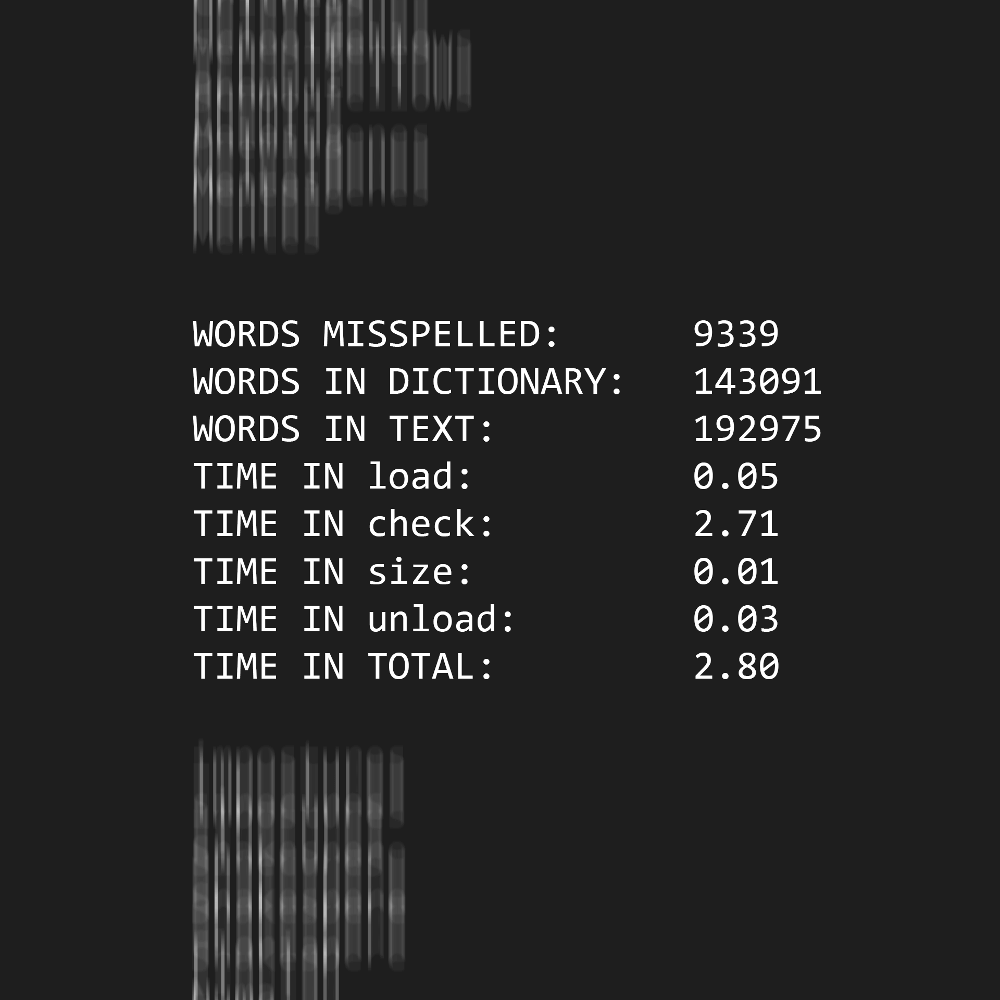

# Speller

An application that spellchecks a file by comparing words from a text file to be spell checked to a dictionary loaded into memory. It then returns the misspelled words it encounters in a list, then ends with the count of words misspelled, words in the dictionary, words in the text being spell checked, and time spent running each function. A dictionary and sample text files to be spell-checked are provided.

## Compiling

* `make` or `make speller` to compile.
* `make clean` to delete `speller` and any `core` or `.o` files

## Running

* To execute: `speller [dictionary] text`
  * `dictionary` is a text file containg a list of lower-case words.
    * If the `dictionary` argument is omitted `speller` will use the default dictionary: `dictionaries/large`. Therefore, `./speller text` is equivalent to `./speller dictionaries/large text`
  * `text` is the file to be spell-checked.
* Examples:
  * `./speller texts/shakespeare.txt`
  * `./speller dictionaries/large texts/shakespeare.txt`
